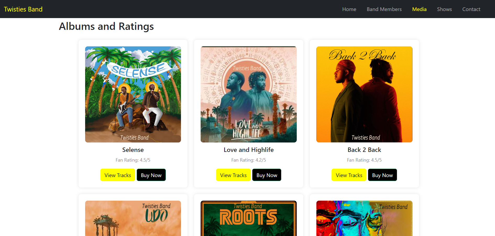

# Twisties Band

This is a static web design for Twisties Band, where the musical magic comes to life! This responsive website is crafted to provide an immersive experience on all devices, ensuring seamless navigation for visitors. The goal is to not only showcase the band's dynamic presence but also to encourage engagement, whether it's booking performances, subscribing for newsletters, buying albums or reaching out directly for inquiries.

## Table of Contents

## User Story

As a music enthusiast or potential fan, you can visit the Twisties Band's website to explore its rich history, get to know the individual band members, delve into their music catalogue, and discover upcoming events. The ultimate goal is to find a platform where you can learn more about the band, purchase their music, and even consider booking them for future events.

## Design and Color Scheme

The choice of colors for the Twisties Band's website is crucial for shaping the overall visual identity and evoking specific emotions among visitors. The combination of black, yellow, and white is justified for the following reasons:

- **Bold and Energetic Presence:**
  Yellow is vibrant and energetic, conveying the band's lively and dynamic nature.

- **Sophistication and Timelessness:**
  The classic combination of black and white exudes sophistication, timelessness, and refinement.

- **Versatility and Readability:**
  Yellow text or graphics on a black or white background enhances readability and visibility.

- **Psychological Impact:**
  Yellow stimulates creativity, optimism, and a sense of warmth, evoking a positive emotional response.

- **Brand Recognition:**
  Consistent color scheme across various branding elements contributes to brand recognition.

- **Highlighting Multimedia Content:**
  Black and white serve as neutral backgrounds that allow multimedia content to pop, with yellow accents adding excitement.

## Features

### Nav Bar
The navigation bar provides a user-friendly way to navigate through different sections of the website.

### Album Gallery
Showcasing the band's music albums, along with album covers, titles, and fan ratings.

### Photo Gallery
Featuring high-quality images capturing the band's performances, behind-the-scenes moments, and promotional photos.

### Band Member Profile
Individual profiles for each band member, showcasing their role, biography, and personal anecdotes.

### Shows
Dedicated to showcasing information about the band's live performances, concerts, and upcoming shows.

### Contact Page
Providing users with a means to get in touch with the band.

## Feature Implementations
This webdesign was done in a rush as I returned from my leave of absence and didnt have much time to complete it. Given more time I would implement a consistent modal dialog across the website. Also, I would integrate the google map api for the contact us page so that fans can see the physical office address of the band. I will introduce icons and consistent typography on the website. In addition, I will save my media files on a CDN platform for optimisation. 

## Accessibility
The HTML code provides a good foundation for an accessible website ensured that the HTML elements are used semantically. Use appropriate tags for headings , etc., lists , and other structural elements to provide a clear document structure. There are descriptive alternative text (alt attribute) for images. The website was tested using only a keyboard and all interactive elements were reachable and operable using keyboard navigation. The document language was specified using the lang attribute in the opening tag. This can assist screen readers in providing accurate pronunciation.

## Technologies Used
GitHub was used for version control. It allowed me to keep track of changes, and provides a centralized repository for the project.

Visual Studio Code (VS Code) is a source-code editor that provides a rich development environment. It supports various programming languages, including HTML, CSS, and JavaScript. I used VS Code to write, edit, and debug my code efficiently.

HTML5 is the latest version of the Hypertext Markup Language, and it was used to structure the content of the website. HTML5 provides semantic elements, which were used to enhance the accessibility and structure of the Twisties Band website.

CSS (Cascading Style Sheets) was used for styling and layout. It allowed me to customize the visual presentation of the website, ensuring a consistent and appealing design across different devices and screen sizes.

Bootstrap is a popular front-end framework that provides pre-designed components and styles. It was used to streamline the development process, as it offers a responsive grid system, UI components, and other helpful features, reducing the need for extensive custom CSS.

Font Awesome is a font and icon toolkit. It was used to integrate scalable vector icons into the website. Icons from Font Awesome were easily customized and provide a visually appealing way to represent different elements, enhancing the overall user experience.

Google Chrome, being a widely used web browser, was the primary browser for testing the website during development. I used Chrome's developer tools to inspect and debug code, ensuring cross-browser compatibility and a seamless user experience.

## Languages Used
HTML, CSS and JavaScript

## Deployment
The website was deployed to Git Pages

## How to Clone
Log into your account on github
Go to the repository of this project /adrianskelton/Projecto1/
Click on the code button, and copy your preferred clone link.
Open the terminal in your code editor and change the current working directory to the location you want to use for the cloned directory.
Type 'git clone' into the terminal, paste the link you copied in step 3 and press enter.

## How to Fork
Log in (or sign up) to Github.
Go to the repository for this project, adrianskelton/Projecto1
Click the Fork button in the top right corner.

## Testing
The html and CSS for Twisties Band's website was tested using the W3C Markup Validation Service

## Credits 
codeinstitute:
for the initial template used to setup the enviroment template 
Bootstrap:
For providing a responsive grid system, components, and styles that contribute to the overall layout and design of the website.

Font Awesome:
Provided the scalable vector icons used in the website, enhancing the visual representation ofthe social media icons.

Google Chrome:
Credits to the Google Chrome browser for testing and debugging during the development process.

jQuery and FancyBox:
For enabling the implementation of image galleries with a lightbox effect on the website which was modified to suit my needs.

Visual Studio Code:
 Visual Studio Code as the source-code editor used for writing, editing, and debugging the HTML, CSS, and JavaScript code.

GitHub:
For version control and providing a platform for hosting the project repository.

Picture/Music:
The pictures and music used on this website are of the CaveMen Band (Nigerian Band) I am a fan of their music and decided to use their pictures for the purpose of this project as it is solely for educational purposes. 

