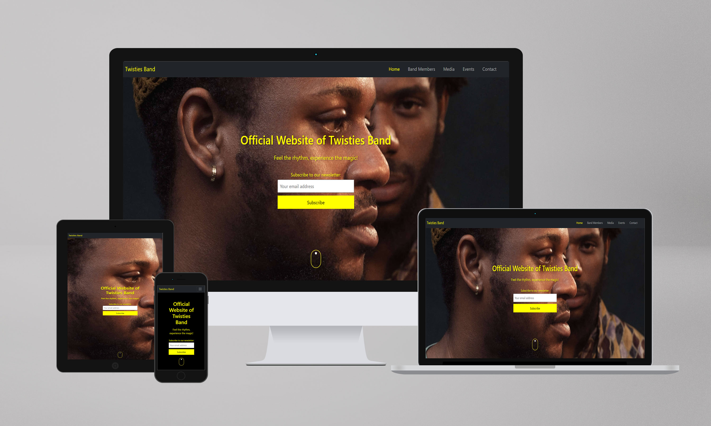

# Twisties Band

This is a static web design for Twisties Band, where the musical magic comes to life! This responsive website is crafted to provide an immersive experience on all devices, ensuring seamless navigation for visitors. The goal is to not only showcase the band's dynamic presence but also to encourage engagement, whether it's booking performances, subscribing for newsletters, buying albums or reaching out directly for inquiries.

## Table of Contents

## User Story

As a music enthusiast or potential fan, you can visit the Twisties Band's website to explore its rich history, get to know the individual band members, delve into their music catalogue, and discover upcoming events. The ultimate goal is to find a platform where you can learn more about the band, purchase their music, and even consider booking them for future events.

## Design and Color Scheme

The choice of colors for the Twisties Band's website is crucial for shaping the overall visual identity and evoking specific emotions among visitors. The combination of black, yellow, and white is justified for the following reasons:

- **Bold and Energetic Presence:**
  Yellow is vibrant and energetic, conveying the band's lively and dynamic nature.

- **Sophistication and Timelessness:**
  The classic combination of black and white exudes sophistication, timelessness, and refinement.

- **Versatility and Readability:**
  Yellow text or graphics on a black or white background enhances readability and visibility.

- **Psychological Impact:**
  Yellow stimulates creativity, optimism, and a sense of warmth, evoking a positive emotional response.

- **Brand Recognition:**
  Consistent color scheme across various branding elements contributes to brand recognition.

- **Highlighting Multimedia Content:**
  Black and white serve as neutral backgrounds that allow multimedia content to pop, with yellow accents adding excitement.

## Features

### Nav Bar
The navigation bar provides a user-friendly way to navigate through different sections of the website.

### Album Gallery
Showcasing the band's music albums, along with album covers, titles, and fan ratings.

### Photo Gallery
Featuring high-quality images capturing the band's performances, behind-the-scenes moments, and promotional photos.

### Band Member Profile
Individual profiles for each band member, showcasing their role, biography, and personal anecdotes.

### Shows
Dedicated to showcasing information about the band's live performances, concerts, and upcoming shows.

### Contact Page
Providing users with a means to get in touch with the band.

